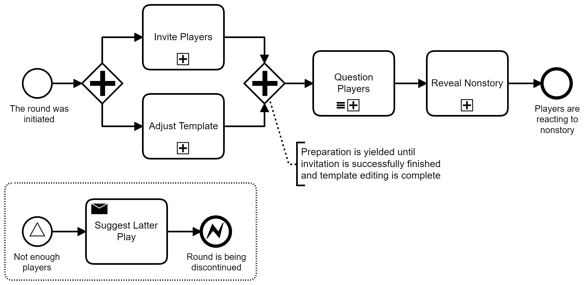

# NonStory – Design

> **NonStory** (a.k.a. "Nonsensical Story") is an improvised party game where players answer given short questions, and as result their answers are composed in a brief nonsensical story which is fun to read!

Here we have specification, art, process diagrams and other design stuff about NonStory.

## Round

**Round** is considered a process in which several players participate in game to get a single nonstory out of their own answers. It is organized as shown in following diagram:

### Invite Players

## Contributing

### Art

We look forward to providing players with better promotional art. Regarding that we ask you to follow some simple rules:
- avoid overloaded graphics with a ton of polygons and curves,
- make sure it follows color scheme provided with logotype and previous promotional art,
- prefer vector graphics when it comes to simpler forms and reusability factor.

### Processes

Making process diagrams in universal form, which is BPMN, is the part of agreeable comprehension.

We use Business Process Model and Notation (BPMN) to describe all possible activities in gameplay and have a perspective look on its extension.

Use [Camunda Modeler](https://camunda.com/download/modeler/) to edit or create BPMN diagrams. It's quite a good tool, I tested! 💯
